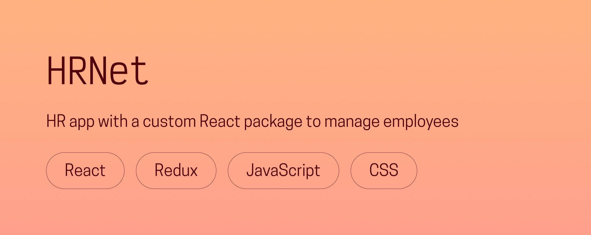

# 🧾 HRNet

**A modern React remake of a fictional human resources management app, featuring a custom data table component.**  
Created in 2023 as part of my front-end development studies.

---

## 🌟 Overview
HRNet is a human resources management platform that allows users to **add, view, and sort employees** through a clean, accessible interface.  

Originally built with **jQuery**, the project was **fully remade with React, Redux, and Material UI** to modernize its architecture and improve accessibility, performance, and scalability.  

As part of the project, I also developed a **custom React table component**, later published as an [NPM package](https://www.npmjs.com/package/@chloeadriancreates/custom-react-table).  
This lightweight (18 KB) component supports pagination, search, and column sorting — all color-customizable and accessible by design.

---

## 🖥️ Live demo
👉 [**Visit HRNet**](https://hrnet.chloeadrian.dev/)  

You can also see its dedicated project page on my [**portfolio**](https://chloeadrian.dev/en/project/hrnet).

---

## ⚙️ Tech stack
- **React** for modern front-end architecture  
- **Redux** for global state management  
- **Material UI** for prebuilt accessible UI components  
- **Sass** for styling consistency  
- **Custom React Table** ([see package](https://github.com/chloeadriancreates/custom-react-table)) for data display  

---

## 🧠 Key features
- Add new employees through a validated form  
- Search and sort through existing employee records  
- Clean, accessible interface built with React and Material UI  
- Custom React table supporting pagination and search  
- Modular component structure for scalability  

---

## 🕊️ Reflection
This project was a turning point in learning **how to refactor legacy code into modern frameworks**.  
Building the **Custom React Table** as a reusable package also deepened my understanding of **modular design, performance optimization, and API flexibility** in the React ecosystem.

Because of the app’s layout and table-heavy content, it is best viewed on larger screens.

---

Thanks for reading, and happy coding!  
Chloé Adrian ✨ 